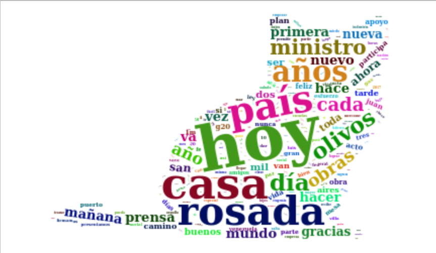
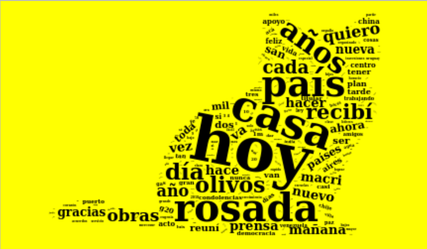
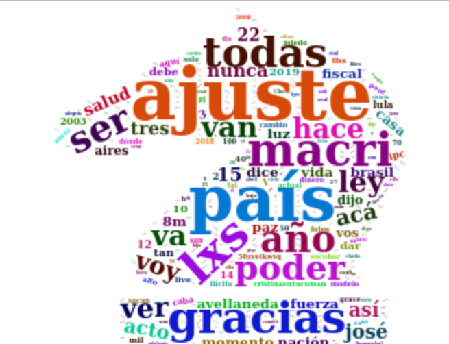
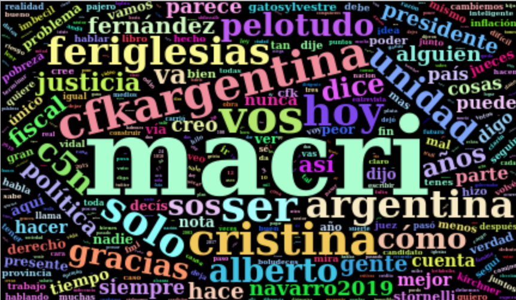
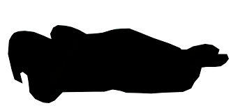
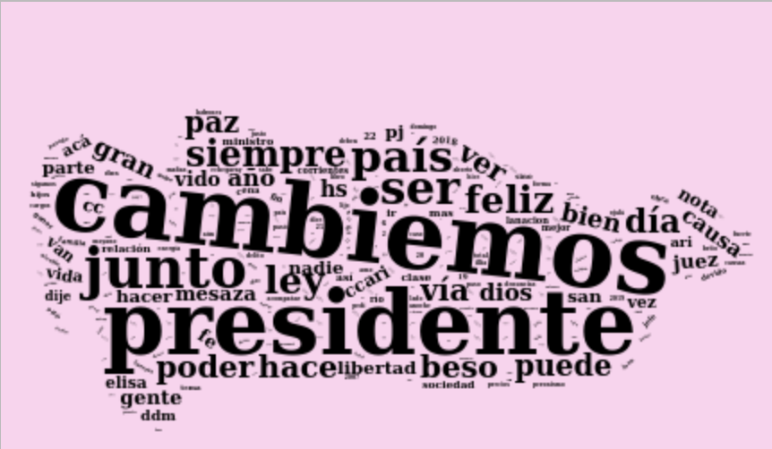
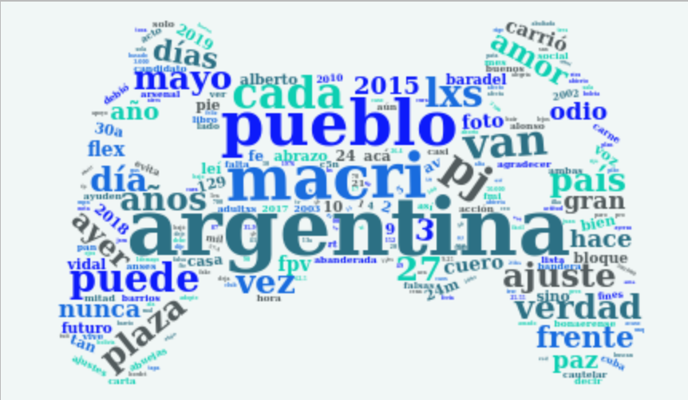

# Nubes de palabras hechas con tweets
### los tweets fueron capturados con el paquete Rtweet, las nubes fueron hechas con WordCloud2
*18-05-19*

Primero instalamos todas las librerías necesarias, son varias porque tenemos que procesar texto
>library(devtools)
>devtools::install_github("lchiffon/wordcloud2")

>library(tidytext)
>library(tm)
>library(dplyr)
>library(stringr)
>library(rtweet)
>library(wordcloud2)

Para extraer los tweets, tenés que tener acceso a la API de Twitter. Es un proceso sencillo, tras pedirlo te dará unas claves que usarás a continuación:
>create_token(
  app = "el nombre de tu app",
  consumer_key = "xxxx",
  consumer_secret = "xxxx",
  access_token = "xxxxx",
  access_secret = "xxxx"
)

Para extraer los tweets de determinado usuario. Entre "" va el nombre de usuario y n es la cantidad de tweets que extraeremos:
>tweets_mm<-get_timeline("mauriciomacri", n=1500)

Procesamos los tweets: 
 Obtenemos las *stopwords* en español, para eso "tomamos prestado" la lista de las mismas en español del paquete TM 
>stopwordsespañol<-bind_rows(stop_words,
                            data_frame(word = tm::stopwords("spanish"),
                            lexicon = "custom"))

Extraemos las palabras y retiramos las *stopwords*
>mm_text <- tweets_mm %>% 
  unnest_tokens(word, text) %>%
  anti_join(stopwordsespañol) %>%
  count(word, sort = TRUE)
 
Llegado a este punto se puede probar hacer la nube de palabras y observar si hay que sacar alguna palabra que no sea stopword, según el caso
>mmtexto <-mm_text %>%
  filter(!word %in% c('t.co', 'https', 'vivo'))

En este caso había muchos videos en vivo y enlaces, por eso retiré algunas más

Para hacer una nube de palabras sencilla
>wordcloud2(mmtexto, size = 0.7)

Tambien se pueden utilizar siluetas y otros colores 
>wordcloud2(mmtexto, figPath = "gato.png", size = 0.5)

>wordcloud2(mmtexto, figPath = "gato.png", size= 0.5, color = "random-darks", backgroundColor = "yellow")

Hagamos el de Cristina Fernández
>tweets_cfk<-get_timeline("CFKArgentina", n=1500)

>cfk_text <- tweets_cfk %>% 
  unnest_tokens(word, text) %>%
  anti_join(stopwordsespañol) %>%
  count(word, sort = TRUE)

 >cfk_text<-cfk_text %>%
  filter(!word %in% c('t.co', 'https', 'vivo','vez', 'ayer', 'día', 'ahora', 'dos', 'sino','casi', 'sólo'))

>wordcloud2(cfk_text, figPath= "36189.png", size = 0.5)

>wordcloud2(cfk_text, size = 0.5)

Alberto Fernández:

Añado una aclaración sobre las siluetas, tienen que ser una imagen con relleno negro (en la parte que aparecerán las palabras) y blanco o transparente el resto, la mayoría de imágenes que utilicé las encontré en la web pero pueden usar cualquiera siempre y cuando cumpla con lo antedicho, lo cual se puede hacer muy fácilmente con algún programa de edición gráfica. es el caso de la imagen siguiente

Máximo Kirchner

